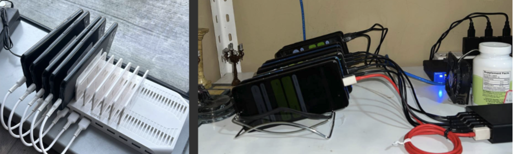

Github links related to the project:
1. https://github.com/Cloakworks-collective/omnicastles_weather
2. https://github.com/Cloakworks-collective/omnicastle_airdao

# Omicastle on Rootstock

In **Omni Castles**, players compete to capture and defend a castle deployed on Rootstock. The objective is to hold the castle as long as possible, earning points as the ruling player. The game features strategic army management, weather effects, and resource management through turns. Players can join, mobilize armies, attack the castle, and change its defense if they become the king (castle's ruler).

## Contributions of the project to Rootstock
Omni Castles is a fully on-chain game deployed on Rootstock, introducing the first oracle-supported mechanics to the platform. Rootstock currently does not have non-pricefeed oracle support, and this project's core innovation lies in introducing **Acurast Oracles** to the ecosystem. The key components include:

### Leveraging Acurast Oracles
Omni Castles utilizes **Acurast** to run Node.js scripts, acting as a critical oracle for non-financial data, such as Fear Freed Index. This Fear Greed data, fetched from the Coin Market Cap API, is central to the in-game mechanics. For instance, Fear Greed Index is updated every 6 hours, and these updates directly influence battles, affecting unit strengths and strategies.

### Decentralized Keepers via Acurast
Acurast also functions as decentralized keepers, executing scheduled cron jobs. In Omni Castles, player statuses are updated every hour, and this automation ensures seamless gameplay. This keeper mechanism can also be extended to other decentralized, turn-based games on Rootstock, creating new possibilities for fully automated, oracle-powered experiences.

## Acurast Integration (Oracle and Keeper) and trust assumptions:
By introducing oracle functionality to Rootstock through **Acurast**, Omni Castles pioneers decentralized gaming on a platform that previously lacked access to such external data. This demonstration opens up new possibilities for other decentralized applications on Rootstock.

Acurast is a decentralized and trustless compute execution layer, leveraging Trust Execution Environments opening up the capability to have Acurast’s Processors (off-chain workers) fetch, sign and submit data on-chain completely trustless and confidential. The processors are highly decentralized and uses processing power of old mobile phones. 

Moreover, we also use a second script to call `tick_tock()` function of the module to update player states every turn. This is a proof of concept use of Acurast processors as ** decentralized keepers**. This function is not gated (anyone call this), however there is an internal check that only affects the game state if it is called after 1 hr has passed.

Note: You can find out more on Acurast's trust minimized processing [here](https://docs.acurast.com/acurast-protocol/architecture/end-to-end/)

Acurast processor clusters are highly decentralized and permissionless, allowing anyone to join and contribute, making the network more resilient and distributed. The picture below showcases various processor clusters. The one on the left represents our cluster, where our proof-of-concept scripts are currently running. In production, we plan to deploy to a randomly selected processor within the Acurast ecosystem (ones that we do not own), with multiple redundancies to further minimize trust assumptions and enhance reliability.



## Key Concepts
- **Castle**: The central stronghold that players aim to capture and defend.
- **Army**: Comprised of archers, infantry, and cavalry units, which are used both in attack and defense.
- **Fear Greed Index**: Impacts army effectiveness in battle Defenders get demoralized when fear is high.
- **Turns**: A resource that limits player actions, such as mobilizing armies and attacking.
- **Points**: Earned by players for successfully attacking the castle or defending it as the king.

## Main Structures
1. **Castle**: Tracks the defending army and the current king of the castle.
2. **Army**: Represents a player's or castle's military power.
3. **Player**: Contains player-specific information such as general name, attacking army composition, points, and available turns.

## Contract Functions

### Public Game Functions

1. **`joinGame(string generalName)`**
   - Allows a player to join the game by creating a player profile with a specified general name. Players are initialized with default army sizes, points, and turns.

2. **`mobilize(uint256 archers, uint256 infantry, uint256 cavalry)`**
   - Allows a player to mobilize an attacking army. It reduces the player’s turns by a fixed amount and requires the total mobilized units to be within a maximum limit.

3. **`setFgIndex(uint256 fgIndex)`**
   - Changes the current game fear greed index.

4. **`attack()`**
   - Allows a player to launch an attack on the castle. If successful, the attacking player becomes the new king. The current king cannot attack. The attack’s success is determined by comparing the attacker’s army power with the castle's defense, factoring in fear greed conditions.

5. **`changeDefense(uint256 archers, uint256 infantry, uint256 cavalry)`**
   - Allows the current king to change the castle's defensive army. This requires a specific number of turns and must not exceed a maximum defense size.

6. **`tickTock()`**
   - Advances the game’s "time," adding turns to players if they haven’t reached the maximum and awarding points to the current king. Can only be called after a specific time interval.

### View Functions

1. **`getPlayerCount()`**: Returns the total number of players.
2. **`getCastle()`**: Retrieves the current state of the castle, including its defending army and current king.
3. **`getPlayer(address playerAddress)`**: Returns the details of a specified player, including their army and points.
4. **`getCurrentFearGreedIndex()`**: Returns the current Fear Greed Index, which impacts battle outcomes.

### Internal Functions

1. **`calculateBattleOutcome(Army memory attackingArmy, Army memory defendingArmy)`**
   - Determines the result of a battle by comparing the power of attacking and defending armies, adjusting for the current fear Greed Index.

2. **`calculateAdjustedArmyPower(Army memory army, uint256 fgindex)`**
   - Adjusts army power based on the fear greed index, favoring certain unit types under specific weather conditions.

## Events

- **PlayerJoined**: Triggered when a player joins the game.
- **ArmyMobilized**: Triggered when a player mobilizes an army.
- **AttackLaunched**: Triggered when an attack on the castle is launched.
- **DefenseChanged**: Triggered when the castle’s defense is modified.
- **TurnAdded**: Triggered when a player gains new turns.
- **FGChanged**: Triggered when the fearGreed Index changes.

## Game Mechanics

- **Fear Greed Effects**: FG Index affects the power of each army unit. For example, defenders have low morale when fear is high.
- **Points System**: Points are awarded to the current king per turn and for successful attacks. Keeping control of the castle increases a player’s score.
- **Turn-Based Resource Management**: Turns are required for most actions, limiting how often players can mobilize armies or attack.

## Quickstart

```
yarn install
yarn chain
```

This command starts a local Ethereum network using Foundry. The network runs on your local machine and can be used for testing and development. You can customize the network configuration in `packages/foundry/foundry.toml`.

```
evm_version = "Istanbul"

[rpc_endpoints]
airDaoDevnet = "https://network.ambrosus-dev.io/"
airDaoTestnet = "https://network.ambrosus-test.io"
airDaoMainnet = "https://network.ambrosus.io"

```

3. deploy the test contract:

Localchain:

```
yarn deploy
```

testnet:

```
yarn deploy --network airdaoTestnet
```
Deployed at: 0xCD05229f4D382c0C8dA75c83011E55299EeA6b2b

Transactions: https://testnet.airdao.io/explorer/address/0x1FC950ff4be0403f9ad51c9192AebbD617b72E4E/

4. Tests 

We have really good test coverage :

```
yarn foundry:test
```


