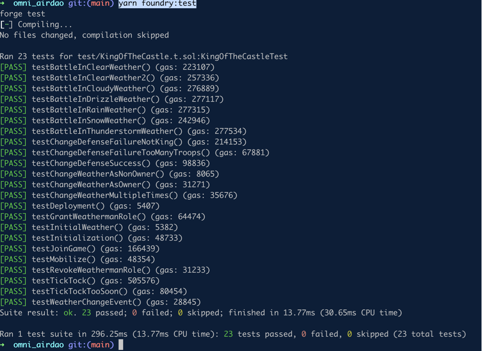

# Omicastle on AirDao

In **Omni Castles**, players compete to capture and defend a castle deployed on AirDAO. The objective is to hold the castle as long as possible, earning points as the ruling player. The game features strategic army management, weather effects, and resource management through turns. Players can join, mobilize armies, attack the castle, and change its defense if they become the king (castle's ruler).

## Key Concepts
- **Castle**: The central stronghold that players aim to capture and defend.
- **Army**: Comprised of archers, infantry, and cavalry units, which are used both in attack and defense.
- **Weather**: Impacts army effectiveness in battle (clear skies, snow, rain, etc.).
- **Turns**: A resource that limits player actions, such as mobilizing armies and attacking.
- **Points**: Earned by players for successfully attacking the castle or defending it as the king.

## Main Structures
1. **Castle**: Tracks the defending army and the current king of the castle.
2. **Army**: Represents a player's or castle's military power.
3. **Player**: Contains player-specific information such as general name, attacking army composition, points, and available turns.
4. **Weather**: An enum defining different weather conditions that affect battle outcomes.

## Contract Functions

### Public Game Functions

1. **`joinGame(string generalName)`**
   - Allows a player to join the game by creating a player profile with a specified general name. Players are initialized with default army sizes, points, and turns.

2. **`mobilize(uint256 archers, uint256 infantry, uint256 cavalry)`**
   - Allows a player to mobilize an attacking army. It reduces the player’s turns by a fixed amount and requires the total mobilized units to be within a maximum limit.

3. **`setWeather(Weather newWeather)`**
   - Changes the current game weather (available only to a role with `WEATHERMAN_ROLE`). Weather affects army strength during battles.

4. **`attack()`**
   - Allows a player to launch an attack on the castle. If successful, the attacking player becomes the new king. The current king cannot attack. The attack’s success is determined by comparing the attacker’s army power with the castle's defense, factoring in weather conditions.

5. **`changeDefense(uint256 archers, uint256 infantry, uint256 cavalry)`**
   - Allows the current king to change the castle's defensive army. This requires a specific number of turns and must not exceed a maximum defense size.

6. **`tickTock()`**
   - Advances the game’s "time," adding turns to players if they haven’t reached the maximum and awarding points to the current king. Can only be called after a specific time interval.

### View Functions

1. **`getPlayerCount()`**: Returns the total number of players.
2. **`getCastle()`**: Retrieves the current state of the castle, including its defending army and current king.
3. **`getPlayer(address playerAddress)`**: Returns the details of a specified player, including their army and points.
4. **`getCurrentWeather()`**: Returns the current weather, which impacts battle outcomes.

### Internal Functions

1. **`calculateBattleOutcome(Army memory attackingArmy, Army memory defendingArmy)`**
   - Determines the result of a battle by comparing the power of attacking and defending armies, adjusting for the current weather.

2. **`calculateAdjustedArmyPower(Army memory army, Weather weather)`**
   - Adjusts army power based on the weather, favoring certain unit types under specific weather conditions.

## Events

- **PlayerJoined**: Triggered when a player joins the game.
- **ArmyMobilized**: Triggered when a player mobilizes an army.
- **AttackLaunched**: Triggered when an attack on the castle is launched.
- **DefenseChanged**: Triggered when the castle’s defense is modified.
- **TurnAdded**: Triggered when a player gains new turns.
- **WeatherChanged**: Triggered when the weather changes.

## Game Mechanics

- **Weather Effects**: Weather affects the power of each army unit. For example, archers are weaker in thunderstorms, while infantry gets stronger.
- **Points System**: Points are awarded to the current king per turn and for successful attacks. Keeping control of the castle increases a player’s score.
- **Turn-Based Resource Management**: Turns are required for most actions, limiting how often players can mobilize armies or attack.

## Quickstart

```
yarn install
yarn chain
```

This command starts a local Ethereum network using Foundry. The network runs on your local machine and can be used for testing and development. You can customize the network configuration in `packages/foundry/foundry.toml`.

```
evm_version = "Istanbul"

[rpc_endpoints]
airDaoDevnet = "https://network.ambrosus-dev.io/"
airDaoTestnet = "https://network.ambrosus-test.io"
airDaoMainnet = "https://network.ambrosus.io"

```

3. deploy the test contract:

Localchain:

```
yarn deploy
```

testnet:

```
yarn deploy --network airdaoTestnet
```
Deployed at: 0xCD05229f4D382c0C8dA75c83011E55299EeA6b2b

Transactions: https://testnet.airdao.io/explorer/address/0x1FC950ff4be0403f9ad51c9192AebbD617b72E4E/

4. Tests 

We have really good test coverage :

```
yarn foundry:test
```


